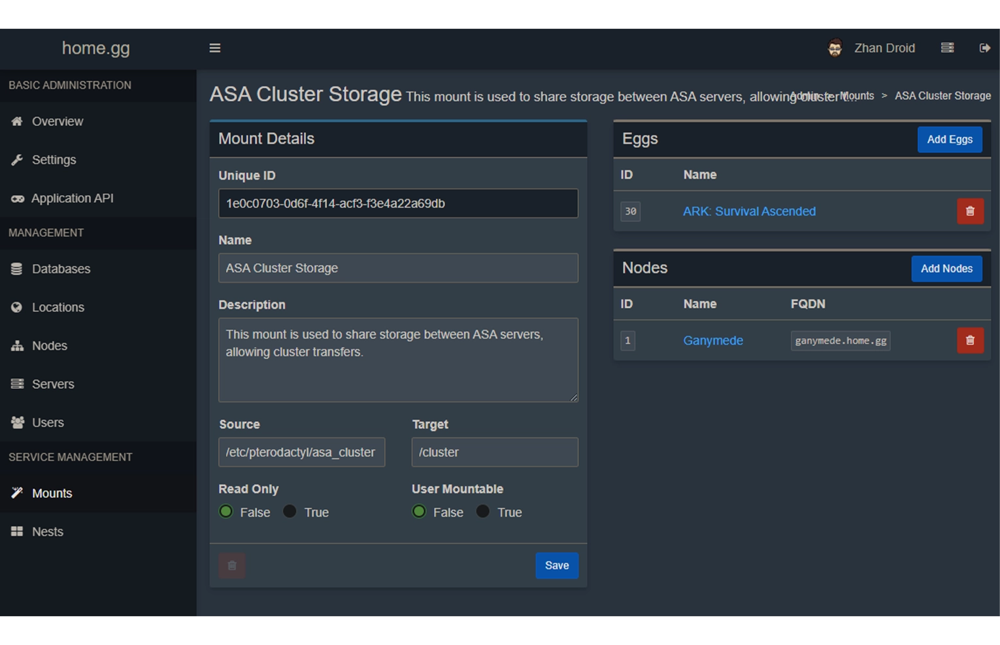

---
head:
  - - meta
    - property: "og:image"
      content: /gameservershub-meta-thumbnail.webp
  - - meta
    - name: description
      content: Explore GameServersHub's Gaming Wiki for in-depth info on Ark Survival Ascended. Discover details on gameplay, features, and updates for the ultimate creature-collecting adventure!
  - - meta
    - name: keywords
      content: Ark Survival Ascended
title: Setting Up Clusters on Pterodactyl
---

# Ark Survival Ascended Setting Up Cluster on Pterodactyl


Our goal for this tutorial is to setup and configure an Ark: Survival Ascended Pterodactyl Cluster.

Note: This guide is for ARK Survival Evolved. If you are looking for ASE directions, see [Setting up ARK Survival Evolved Cluster in Pterodactyl.](#)

## Pterodactyl ASA Cluster Creation​

The [Pterodactyl Panel](https://pterodactyl.io/) runs all of it’s game servers inside of a docker container. These containers are isolated from each other by default.

For this guide, we have chosen the wings host folder /etc/pterodactyl/asa_cluster. For most users, this directory should work just fine but this folder can reside anywhere on the wings host machine.

To begin, you will need to open an SSH session to your server hosting the wings instance as root, or have sudo capabilities.

### Create Path and Set Permissions for Cluster Storage​

```sh
sudo mkdir /etc/pterodactyl/asa_cluster
```

```sh
sudo chown pterodactyl:pterodactyl /etc/pterodactyl/asa_cluster
```

## ​Edit Wings Configuration File​

### Allow Pterodactyl to mount the host cluster directory​

```sh
sudo nano /etc/pterodactyl/config.yml
```

Towards the bottom of this file, find:

```sh
allowed_mounts: []
```

Change this to

```sh
allowed_mounts:
   - /etc/pterodactyl/asa_cluster
```

### Restart wings​

Restarting your wings service will not interfere with any game servers still running on the host. This is only the communication daemon between wings and your panel.

```sh
sudo systemctl restart wings
```

## Creating the Pterodactyl Mount in Administration​

### Mounts > Create New​

Give the mount your preferred name and description as shown below, and choose Create.


### Add the ARK Survival Ascended Egg and your Node to the Mount



### Attach the Mount to Each Server in the Cluster​

Stop your Ark Survival Ascended servers. For each of your ARK servers, go to Servers > ASA Servers > Mounts and click the + button to add the newly created Pterodactyl mount


### Modify Startup Parameters for Each Server in the Cluster​

In the Additional Arguments field on each of the servers you want to cluster, you will need to add 3 parameters to this field. Be sure to choose a unique clusterid, but use the same one for the servers you want to connect. Since ARK Survival Ascended is running on a linux docker container with Proton, you will need to use a windows style directory. By default, Proton will mount the linux root on the Z: drive.

```txt
-NoTransferFromFiltering -clusterid=myuniqeclustername -ClusterDirOverride="Z:\cluster"
```


### Ensure GameUserSettings.ini on all servers are configured correctly​

Below are 2 examples on how to setup your `GameUserSettings.ini`. Servers do not need to match exactly. The 2nd example shows how you would add a new server and only allow characters to transfer on and off of it. This is similar to what official servers do on new map release

#### Full transfers to and from the cluster​

```ini
[ServerSettings]
NoTributeDownloads=False
PreventUploadSurvivors=False
PreventUploadItems=False
PreventUploadDinos=False
PreventDownloadSurvivors=False
PreventDownloadItems=False
PreventDownloadDinos=False
```

#### Character only to and from the cluster​

```ini
[ServerSettings]
NoTributeDownloads=False
PreventUploadSurvivors=False
PreventUploadItems=True
PreventUploadDinos=True
PreventDownloadSurvivors=False
PreventDownloadItems=True
PreventDownloadDinos=True
```

## Start ARK Survival Ascended Servers and Enjoy!​

The Ark: Survival Ascended Pterodactyl Cluster should now be working. Thanks for following my guide. If you have questions or comments, feel free to leave them here and I will do my best to answer them!
