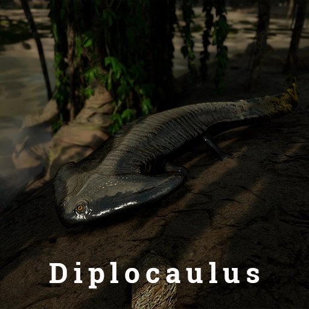

---
head:
  - - meta
    - property: "og:image"
      content: /path of titans - 667x260.webp
  - - meta
    - name: description
      content: Explore GameServersHub's Gaming Wiki for in-depth info on Path of Titans. Find details on gameplay, features, and updates for the ultimate dino MMO adventure!
  - - meta
    - name: keywords
      content: Path Of Titans
title: Default Curve Overrides
---

# Path of Titans AI Critters

Below is a list of all Alderon AI Critters with link to show their curve overrides

## [Baurubatrachus](./path-of-titans-baurubatrachus)

## [Centrochelys](./path-of-titans-centrochelys)

## [Didelphodon](./path-of-titans-didelphodon)

## [Diplocaulus](./path-of-titans-diplocaulus)

## [Dynamosuchus](./path-of-titans-dynamosuchus)

## [Limulus](./path-of-titans-limulus)

## [Megalochelys](./path-of-titans-megalochelys)

## Ocypode

## [Palaeosaniwa](./path-of-titans-palaeosaniwa)

## [Platyhystrix](./path-of-titans-platyhystrix)

## [Pseudocarcinus](./path-of-titans-pseudocarcinus)

## [Pulmonoscorpius](./path-of-titans-pulmonoscorpius)

## [Wadiasaurus](./path-of-titans-wadiasaurus)

## [Wonambi](./path-of-titans-wonambi)

