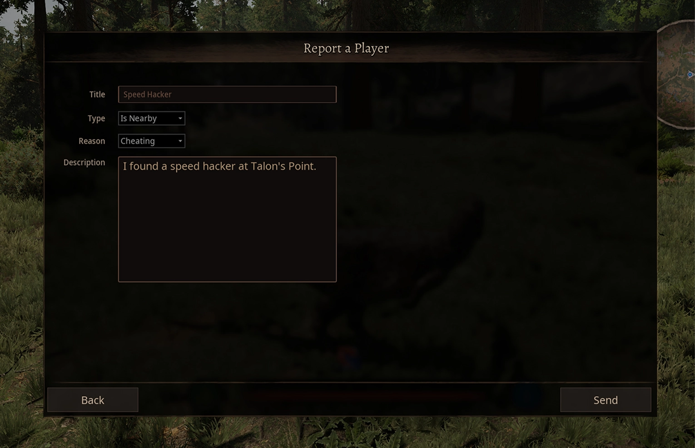

---
head:
  - - meta
    - property: "og:image"
      content: /path of titans - 667x260.webp
  - - meta
    - name: description
      content: Explore GameServersHub's Gaming Wiki for in-depth info on Path of Titans. Find details on gameplay, features, and updates for the ultimate dino MMO adventure!
  - - meta
    - name: keywords
      content: Path Of Titans
title: In-Game Reports
---

# Path of Titans In-Game Reports

If your community server has a big Discord community, it may be useful to have player reports sent directly to your Discord server. This way you can have moderators or admins easily access all reports at a glance.

## Editing the Game.ini

::: warning
The server must be stopped while editing server files. You must save your edits and restart your server for any edits to take effect.
:::

To setup In-Game Player reports, you must edit the `Game.ini` file. You can find this file in the following location:

<ul class="breadcrumbs" data-v-1536bbb2="">
<li class="first" data-v-1536bbb2="">
<span data-v-1536bbb2="">
<i class="fas fa-folder" data-v-1536bbb2=""></i> PathofTitans
</span>
</li>
<li class="" data-v-1536bbb2="">
<span data-v-1536bbb2="">
<i class="fas fa-folder" data-v-1536bbb2=""></i> Saved
</span>
</li>
<li class="" data-v-1536bbb2="">
<span data-v-1536bbb2="">
<i class="fas fa-folder" data-v-1536bbb2=""></i> Config
</span>
</li>
<li class="" data-v-1536bbb2="">
<span data-v-1536bbb2="">
<i class="fas fa-folder" data-v-1536bbb2=""></i> LinuxServer
</span>
</li>
<li class="last" data-v-1536bbb2="">
<span data-v-1536bbb2="">
<i class="fas fa-file" data-v-1536bbb2=""></i> Game.ini
</span>
</li>
</ul>

::: info
`LinuxServer` is the folder name for Linux servers. If you are using a different operating system, the folder name will be different but the other folders will be the same.
:::

Underneath the `[ServerWebhooks]` header, create an entry `PlayerReport="https://discord-webhook-url-here/"`

### Example Game.ini

```ini
[ServerWebhooks]
bEnabled=true
Format="Discord"
PlayerReport="https://discord-webhook-url-here/"
```

## Creating Discord Webhooks
You can create a Discord webhook for your Discord channel by following these steps:

1. Go into your desired channel settings and select "Integrations"
2. Create a new webhook.
3. Copy the webhook URL and paste it into your Game.ini file.

## In-Game Player Reports

When on a community server, player reports will not be sent to Alderon Games, and will instead be sent to the community server admins. When in-game, players can press the "P" button to bring up the Player Report feature. They can choose the report type and enter more information about their report. We suggest you encourage your players to use the in-game report feature, as it will automatically grab important information like Alderon Game IDs and map locations.

