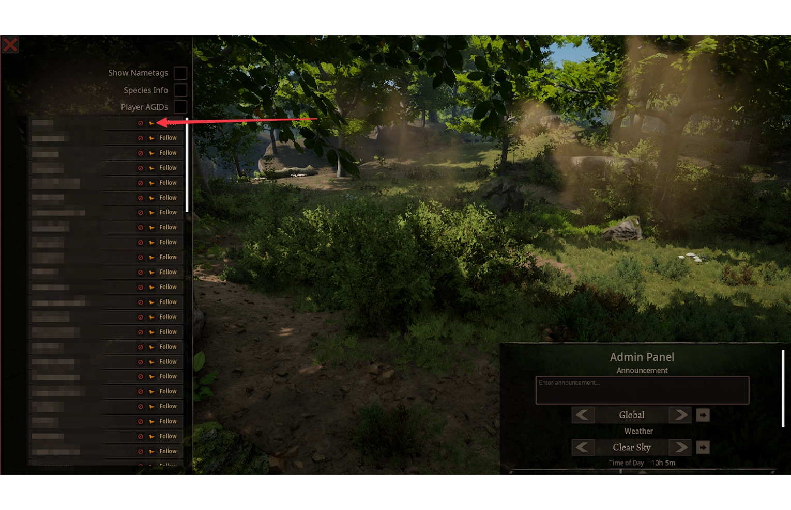

---
head:
  - - meta
    - property: "og:image"
      content: /path of titans - 667x260.webp
  - - meta
    - name: description
      content: Explore GameServersHub's Gaming Wiki for in-depth info on Path of Titans. Find details on gameplay, features, and updates for the ultimate dino MMO adventure!
  - - meta
    - name: keywords
      content: Path Of Titans
title: Player Management
---

# Path of Titans Player Management

Managing players on your server is an important part of running a community server. This guide will show you how to manage players on your server using the in-game chat commands and the Spectator Tool.

## Kicking Users

You can easily kick players from your server via the in-game chat commands.

### Kicking Players In-Game

First, log into your server, then there are the two methods you can use to kick players:

#### Via Chat Commands

Kick a given user with the optional reason. You can leave the kick reason blank if desired.

`/kick [playername> [kick reason>`

> Example: /kick that411guy Spamming the chat.
>
> Kick a given user with the optional reason.

#### Via Spectation Tool

While in Spectator Mode, you are able to click "Kick" next to the player's name to kick them from the server. Upon kicking a player, it will prompt you for a Kick Reason. This is optional, and can be left blank if desired.



## Banning and Unbanning Users

Sometimes you may need to ban a player from your server. This can be done via the `bans.txt` file or via the in-game chat commands or Spectator Tool.

### Ban via bans.txt file

::: tip
The `bans.txt` file will hot reload once a minute if changed and there is an in-game command to add / remove items from the list (see below). We recommend adding bans with RCON commands or in-game chat commands!
:::

First, locate your `bans.txt` file. You can normally find this file in the following location:

<ul class="breadcrumbs" data-v-1536bbb2="">
<li class="first" data-v-1536bbb2="">
<span data-v-1536bbb2="">
<i class="fas fa-folder" data-v-1536bbb2=""></i> PathofTitans
</span>
</li>
<li class="" data-v-1536bbb2="">
<span data-v-1536bbb2="">
<i class="fas fa-folder" data-v-1536bbb2=""></i> Saved
</span>
</li>
<li class="last" data-v-1536bbb2="">
<span data-v-1536bbb2="">
<i class="fas fa-file" data-v-1536bbb2=""></i> bans.txt
</span>
</li>
</ul>

If you do not have this file or have not yet created this file, follow these steps:

1. In the Saved folder you must create a file called bans.txt.
2. Add the banned users for your server in the text file and click "Save".

::: warning
You must add each ban on a new line.
:::

Formatting the `bans.txt` file is quite simple. Each line in your text file must follow this format:

`AGID:UnixTimestamp:AdminReason:UserReason`

Here is a breakdown of each part of the line:

`AGID`

>**Example:** `123-443-512`
>
>The Alderon Games ID of the player.

`UnixTimestamp`

>**Example:** `1644464516`
>
>If the ban is temporary, enter the Unix Timestamp of the date the player will be unbanned. You can generate the timestamp [here](https://www.epochconverter.com/). If the ban is permanent, set this to `0`.

`AdminReason`

>**Example:** `Admin message here!`
>
>An internal message that will only be visible by admins. Useful for keeping notes. Can be left blank. NOTE: you cannot use a colon `:` in this description or else it will break your bans.

`UserReason`

>**Example:** `Banned for spamming the chat`
>
>The message the user will see when attempting to join your server. Ensure this is descriptive so the player understand why they were banned. NOTE: you cannot use a colon `:` in this description or else it will break your bans.

#### Example bans.txt

```txt
525-053-709:0:Reason for admins here:Stay out of my server
123-456-678:1645059401:I have banned them:Broke rule number three
543-226-532:1645059400:admin note here:You are banned because you were rude
766-980-003:0::Broke rule 12 so you are permabanned.
```

### Banning Players In-Game

Using the in-game [Admin Chat Commands](./path-of-titans-chat-commands#admin-commands) or the Spectator Tool, you can ban players from your server. This is the recommended method of banning players as it will automatically add the ban to your `bans.txt` file and has lower chance of error.

#### Via Chat Commands

You can easily ban players via the in-game chat commands. Here are the three commands you can use:

`/ban [playername] [ban reason]`

>**Example:** /ban that411guy Breaking rule 12 Bans the user from the server based on their Alderon Games Username. You can leave the ban reason blank if desired. Also supports [userbanreason] and [duration] arguments.

`/ban [IPAddress] [ban reason]`

>**Example:** /ban 199.199.1.99 Breaking rule 12 Bans the user from the server via their IP address. You can leave the ban reason blank if desired. Also supports [userbanreason] and [duration] arguments.

`/ban [AGID] [ban reason]`

>**Example:** /ban 123-456-789 Breaking rule 12 Bans the user via their Alderon Games ID number. You can leave the ban reason blank if desired. Also supports [userbanreason] and [duration] arguments.

`/unban [playername]`

>**Example:** /unban that411guy Unbans the user via their Alderon Games Username.

`/unban [IPAddress]`

>**Example:** /unban 199.199.1.99 Unbans the user via their IP Address.

`/unban [AGID]`

>**Example:** /unban 123-456-789 Unbans the user via their Alderon Games ID number.

`/reloadbans`

>**Example:** /reloadbans The bans list will be refreshed every 1 minute, however this command will reload it immediately.b