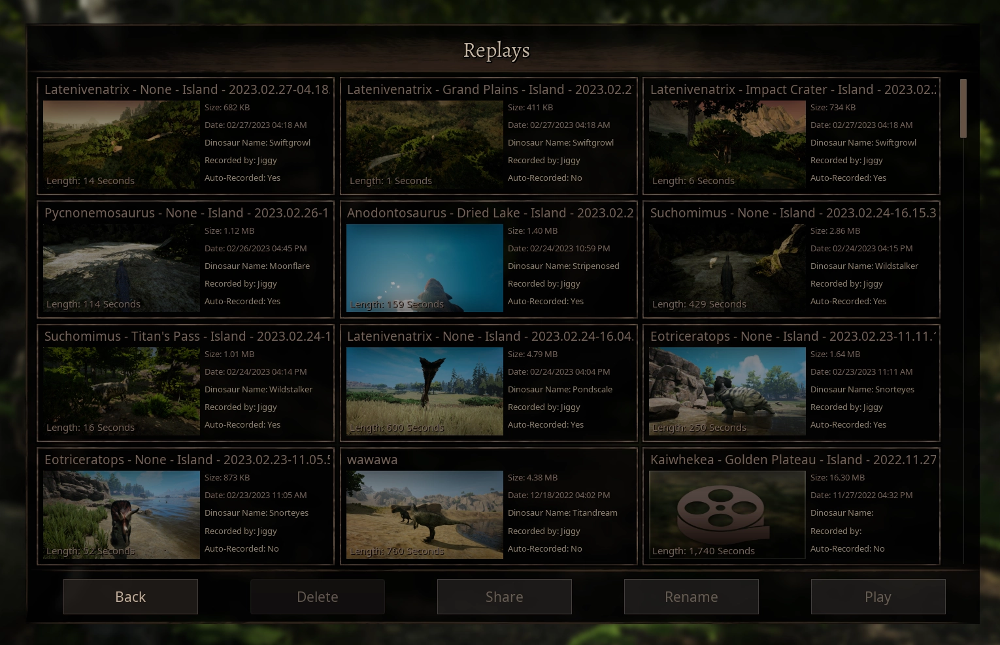
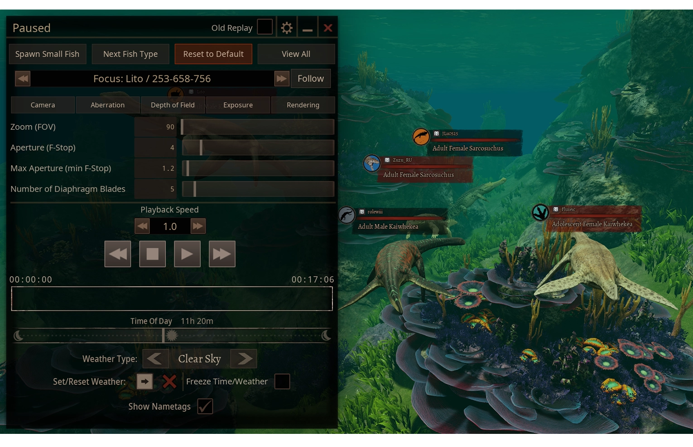

---
head:
  - - meta
    - property: "og:image"
      content: /path of titans - 667x260.webp
  - - meta
    - name: description
      content: Explore GameServersHub's Gaming Wiki for in-depth info on Path of Titans. Find details on gameplay, features, and updates for the ultimate dino MMO adventure!
  - - meta
    - name: keywords
      content: Path Of Titans
title: Replay Recordings
---

# Path of Titans Replay Recordings

::: danger
The Replay Tool is not yet released on mobile platforms (iOS and Android).
:::

You can use Replay Recordings to help moderate your server. If a player claims they were unfairly killed, saw a rulebreaker, or otherwise wants to report something, you can ask them for Replay Recording evidence.

Replays will record the gameplay of all players within render distance of the player recording the replay. It will show nametags, growth stages, grouped players, and more. With this information, you can make judgements on player behaviour without needing active moderators to watch all the time.

There are two aspects to Replay Recordings: Client Side and Server Side recordings.

## Enabling Client Side Replays

Enabling Client Side Replays:

Path:

<ul class="breadcrumbs" data-v-1536bbb2="">
  <li class="first" data-v-1536bbb2="">
    <span small-font="">
      <i class="fas fa-folder" data-v-1536bbb2=""></i> C:
    </span>
  </li>
  <li class="" data-v-1536bbb2="">
    <span small-font="">
      <i class="fas fa-folder" data-v-1536bbb2=""></i> Users
    </span>
  </li>
  <li class="" data-v-1536bbb2="">
    <span small-font="">
      <i class="fas fa-folder" data-v-1536bbb2=""></i> %UserName%
    </span>
  </li>
  <li class="" data-v-1536bbb2="">
    <span small-font="">
      <i class="fas fa-folder" data-v-1536bbb2=""></i> AppData
    </span>
  </li>
  <li class="" data-v-1536bbb2="">
    <span small-font="">
      <i class="fas fa-file" data-v-1536bbb2=""></i> Local
    </span>
  </li>
  <li class="" data-v-1536bbb2="">
    <span small-font="">
      <i class="fas fa-file" data-v-1536bbb2=""></i> PathOfTitans
    </span>
  </li>
  <li class="" data-v-1536bbb2="">
    <span small-font="">
      <i class="fas fa-file" data-v-1536bbb2=""></i> Saved
    </span>
  </li>
  <li class="last" data-v-1536bbb2="">
    <span small-font="">
      <i class="fas fa-file" data-v-1536bbb2=""></i> Demos
    </span>
  </li>
</ul>

To enable your own recording of replays, you can use the following configuration in `Game.ini`:

```ini
[/Script/PathOfTitans.IGameSession]
bServerAllowReplayRecording=true
```

## Enabling Server Side Replays

You can enable server side auto recording to help with moderation of a server.

This needs to be enabled before the server boots up to take effect.

It will stop recording on server shutdown and the recording will be saved in the server folder:

<ul class="breadcrumbs" data-v-1536bbb2="">
  <li class="first" data-v-1536bbb2="">
    <span med-font="">
      <i class="fas fa-folder" data-v-1536bbb2=""></i> PathOfTitans
    </span>
  </li>
  <li class="" data-v-1536bbb2="">
    <span med-font="">
      <i class="fas fa-folder" data-v-1536bbb2=""></i> Saved
    </span>
  </li>
  <li class="" data-v-1536bbb2="">
    <span med-font="">
      <i class="fas fa-folder" data-v-1536bbb2=""></i> Demos
    </span>
  </li>
  <li class="last" data-v-1536bbb2="">
    <span med-font="">
      <i class="fas fa-folder" data-v-1536bbb2=""></i> [Map][Time].replay
    </span>
  </li>
</ul>

To do this there are currently two methods:

### Config Editing Method

Inside the server configuration `Config/LinuxServer/Game.ini` add these lines

```ini
[/Game/Blueprints/GameModes/BP_GameMode_Sandbox.BP_GameMode_Sandbox_C]
bHandleDedicatedServerReplays=True
```

This will enable server automatic replay recording next time the server is booted up.

### In-Game Chat Command Method

You can join the server and use `/ServerAutoRecord 1` to enable this next time the server is rebooted.

::: warning
Note you require admin permissions to use this command.
:::

To disable this feature, login to the server and use `/ServerAutoRecord 0`.

Or delete the configuration `bHandleDedicatedServerReplays=true` in `Game.ini`.

Or set it to false like this:

```ini
[/Game/Blueprints/GameModes/BP_GameMode_Sandbox.BP_GameMode_Sandbox_C]
bHandleDedicatedServerReplays=false
```
::: info
In the case of a server crash, the replay will be buffered up to a certain point, as the game saves it frequently. Some footage could be lost.
::: details
As another caveat, in the case of a server crash, the replay could be missing the time and simply be called [MapName].replay.
:::

## Adding Replay Recordings

When you are provided with a .replay file, you must put the file in the following location:

<ul class="breadcrumbs" data-v-1536bbb2="">
  <li class="first" data-v-1536bbb2="">
    <span small-font="">
      <i class="fas fa-folder" data-v-1536bbb2=""></i> C:
    </span>
  </li>
  <li class="" data-v-1536bbb2="">
    <span small-font="">
      <i class="fas fa-folder" data-v-1536bbb2=""></i> Users
    </span>
  </li>
  <li class="" data-v-1536bbb2="">
    <span small-font="">
      <i class="fas fa-folder" data-v-1536bbb2=""></i> %UserName%
    </span>
  </li>
  <li class="" data-v-1536bbb2="">
    <span small-font="">
      <i class="fas fa-folder" data-v-1536bbb2=""></i> AppData
    </span>
  </li>
  <li class="" data-v-1536bbb2="">
    <span small-font="">
      <i class="fas fa-file" data-v-1536bbb2=""></i> Local
    </span>
  </li>
  <li class="" data-v-1536bbb2="">
    <span small-font="">
      <i class="fas fa-file" data-v-1536bbb2=""></i> PathOfTitans
    </span>
  </li>
  <li class="" data-v-1536bbb2="">
    <span small-font="">
      <i class="fas fa-file" data-v-1536bbb2=""></i> Saved
    </span>
  </li>
  <li class="last" data-v-1536bbb2="">
    <span small-font="">
      <i class="fas fa-file" data-v-1536bbb2=""></i> Demos
    </span>
  </li>
</ul>

Then, you must restart you game for the new replays to be visible.

| Item          | Description                                                                                |
| ------------- | ------------------------------------------------------------------------------------------ |
| Date          | Time the replay was recorded at (Note: this will be the local user's time on their device) |
| Auto-Recorded | Whether or not the replay was recorded automatically or manually started by the player.    |

::: info
If the metadata of the replay is empty, it means you were only provided the `.replay` file. This is still a valid recording, but you will have to view the replay to see more information about it.
:::



## Viewing Replay Recordings

Once you are provided with a Replay Recording, view the replay to see the relevant gameplay. Be sure to jump to the user in question.

