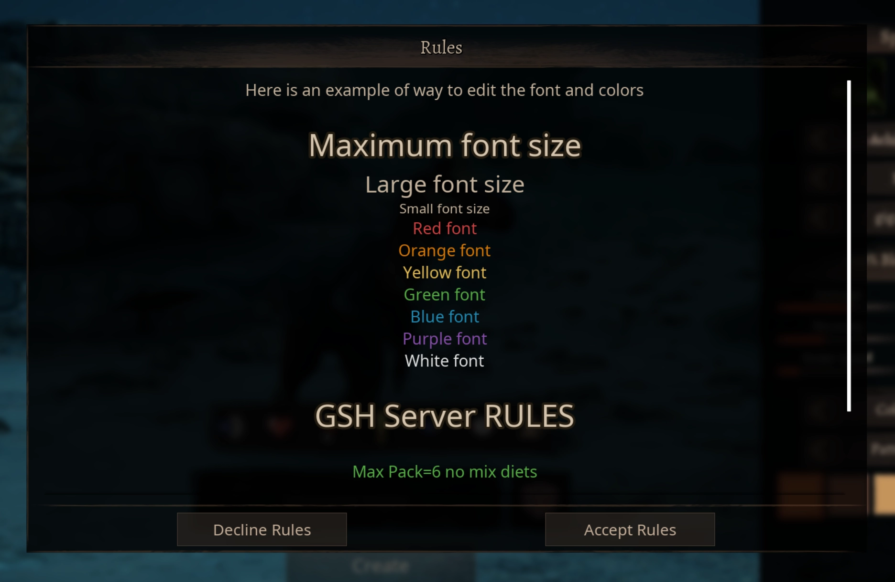

---
head:
  - - meta
    - property: "og:image"
      content: /path of titans - 667x260.webp
  - - meta
    - name: description
      content: Explore GameServersHub's Gaming Wiki for in-depth info on Path of Titans. Find details on gameplay, features, and updates for the ultimate dino MMO adventure!
  - - meta
    - name: keywords
      content: Path Of Titans
title: Server Rules
---

# Path of Titans Server Rules

Setting up Rules is useful for letting your players know the rules for your server. The rules popup will appear the first time a player logs into your server. They must click the "I Accept" button in order to continue playing on your server, otherwise they will be disconnected.

Players can also use the `/rules` chat command in-game to read your rules if they need to remind themselves.

::: warning
The server must be stopped while editing server files. You must save your edits and restart your server for any edits to take effect.
:::

The process for setting up Rules is the same as setting up a [Message of the Day:](./path-of-titans-motd-setup)

1. In the Saved folder you must create a file called `Rules.txt`
2. Enter the MOTD for your server in the text file and click "Save".

You can find this file in the following location:

`PathofTitans/Saved/Rules.txt`

## Formatting

You can use text formatting to make your `Rules.txt` look nicer or better organize your messages.

::: info
Formatting cannot be combined (example, `<title><red>This is my title!</></>` will only use the title format). Alderon currently do not support Markdown or HTML in the `Rules.txt`, Alderon only support the formatting as described below.
:::

You must close formatting with `</>`.

`<title>` - Largest title font size.

`<large>` - Large font size.

`<small>` - Small font size.

`<red>` - Use red text colour.

`<orange>` - Use orange text colour.

`<yellow>` - Use yellow text colour.

`<green>` - Use green text colour.

`<blue>` - Use blue text colour.

`<purple>` - Use purple text colour.

`<white>` - Use white text colour.

## Example Rules.txt

Here is an example of way to edit the font and colors

```js
<title> Maximum font size </>
<large> Large font size </>
<small> Small font size </>
<red> Red font </>
<orange> Orange font </>
<yellow> Yellow font </>
<green> Green font </>
<blue> Blue font </>
<purple> Purple font </>
<white> White font </>

<title>GSH Server RULES</>

<green>Max Pack=6 no mix diets</>

<orange>Be Respectful at all times</>

<large>Thanks, and have fun!</>
```


